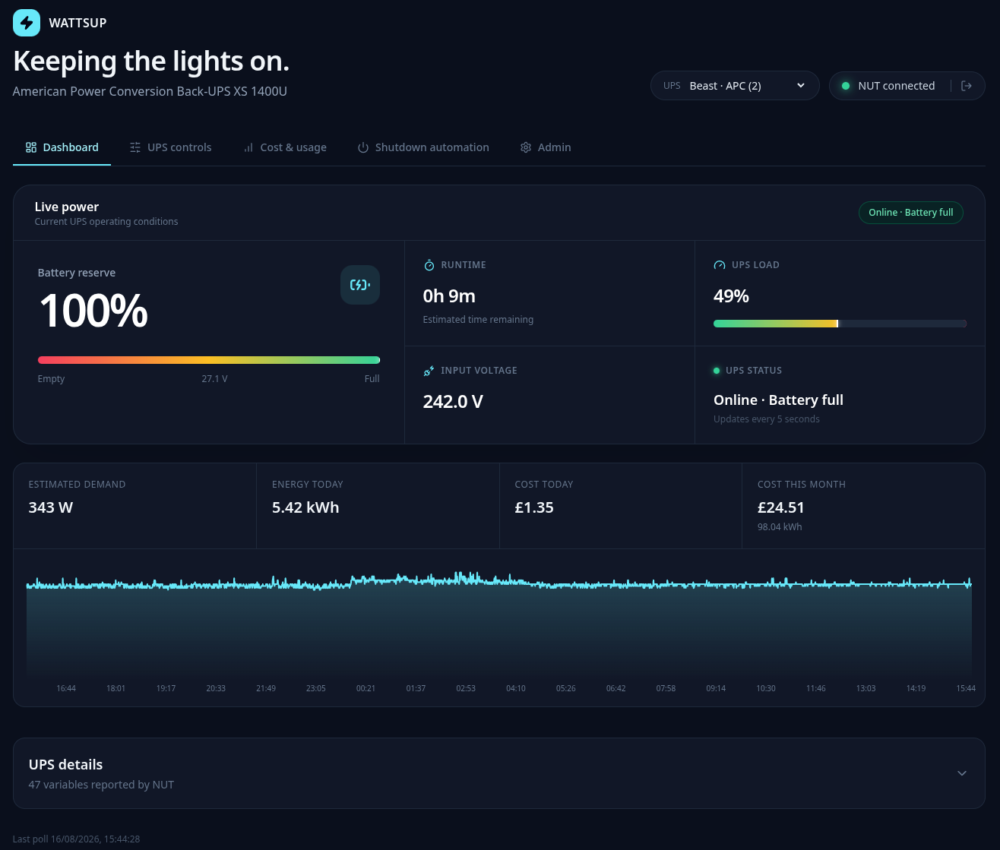
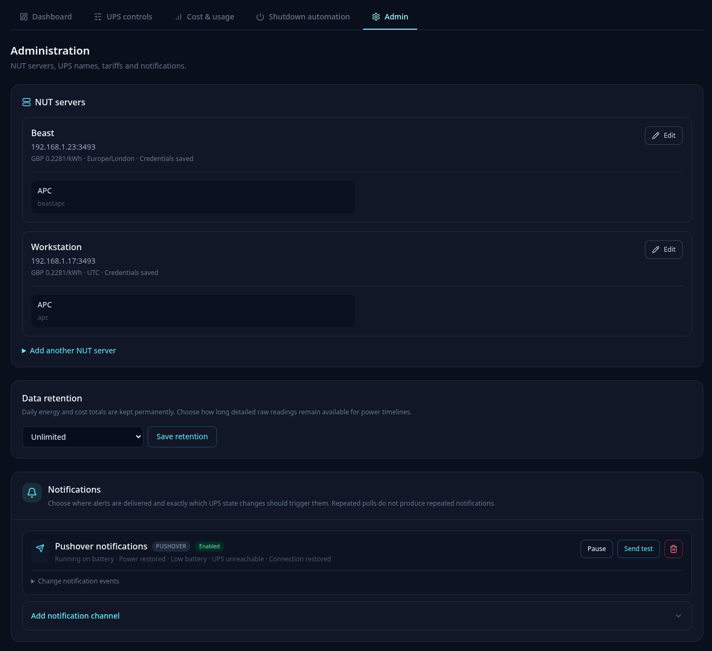
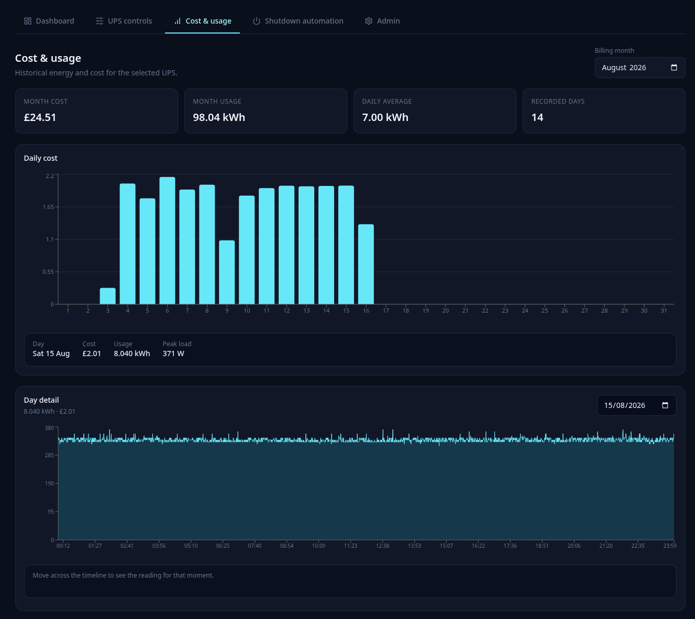
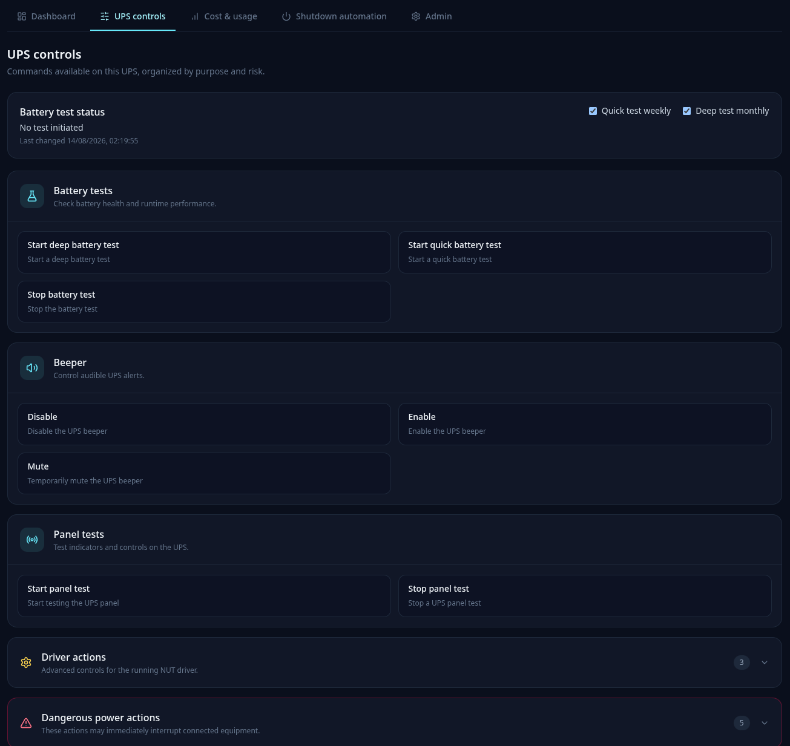
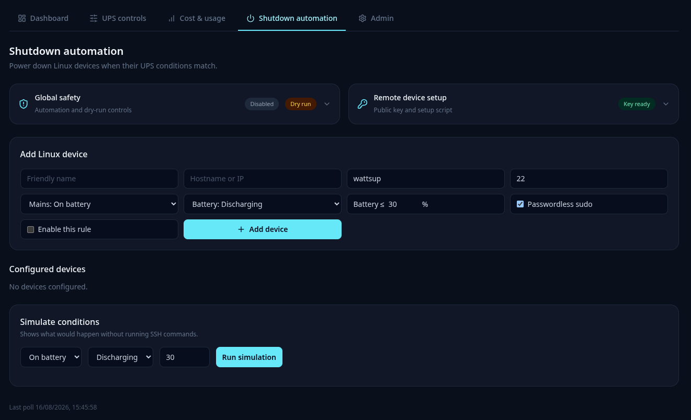

# WattsUp

WattsUp is a self-hosted management interface for
[Network UPS Tools (NUT)](https://networkupstools.org/). It monitors UPS units across multiple NUT
servers, provides guarded UPS controls, estimates energy costs, sends outage notifications, and
automates safe shutdowns of remote Linux devices.



## Features

- Multiple NUT servers with editable, connection-tested addresses, ports, and credentials
- Automatic UPS discovery and friendly, editable UPS names
- Five-second live dashboard updates and human-readable NUT states
- Battery, runtime, load, voltage, power, firmware, driver, and full NUT variable details
- PostgreSQL history collected every 30 seconds
- Measured power when `ups.realpower` is available
- Estimated power from UPS load and nominal real power when it is not
- Daily and monthly kWh/cost totals with a 24-hour power graph
- Dedicated Cost & Usage dashboard with day and month selection
- Permanent daily billing totals and configurable raw-reading retention
- Effective-dated tariff history and per-server billing time zones
- Flat electricity tariff and currency configured separately for each NUT server
- Dynamically discovered and grouped UPS instant commands
- Live battery-test results with configurable weekly quick and monthly deep-test schedules
- Typed confirmation for dangerous power commands
- Database-backed administrator authentication
- SMTP, Gotify, Pushover, and generic webhook notification channels
- On-battery, restored, low-battery, unreachable, and reconnected notification events
- Per-device remote Linux shutdown rules tied to a specific UPS
- Ed25519 SSH keys, host-key approval, readiness tests, simulation, and global dry-run mode
- Responsive layouts for phones, tablets, and desktop browsers

## Requirements

- Docker with Docker Compose
- One or more NUT servers reachable from the WattsUp container, normally on TCP port `3493`
- For UPS controls, NUT accounts authorized to run instant commands
- For remote shutdown, Linux devices with an SSH server

A NUT listener bound only to `127.0.0.1` cannot be reached from another container or host.

Suggested filenames are `dashboard.png`, `cost-and-usage.png`, `ups-controls.png`,
`shutdown-automation.png`, and `administration.png`. PNG or WebP both work; avoid including real
IP addresses, hostnames, usernames, notification endpoints, or other private infrastructure in the
captured interface.

## Installation

### One-command deployment

On a Linux host with Git, OpenSSL, Docker, and Docker Compose v2:

```shell
curl -fsSL https://raw.githubusercontent.com/rootifera/WattsUp/main/deploy.sh | sudo bash
```

The script installs WattsUp in `/opt/wattsup`, creates a private `.env` with random database, JWT,
and first-run setup secrets, builds the stack, applies the Alembic database migrations, waits for
healthy containers, and prints the installation URL and setup token.

Run the same command later to update. It fast-forwards the checkout to the latest `main`, preserves
`.env` and the PostgreSQL/SSH Docker volumes, adds newly required environment settings, rebuilds,
applies all pending Alembic migrations, and waits for a healthy deployment. It refuses to overwrite
a checkout containing local changes.

When the command is run from a directory containing `.env`, that directory is treated as the
existing installation automatically. It will not clone another copy into `/opt/wattsup`.

Optional overrides can be passed through `sudo env`:

```shell
curl -fsSL https://raw.githubusercontent.com/rootifera/WattsUp/main/deploy.sh |
  sudo env WATTSUP_DIR=/srv/wattsup WATTSUP_BRANCH=main bash
```

### Manual deployment

Copy and edit the environment file:

```shell
cp .env.example .env
```

```env
POLL_INTERVAL_SECONDS=30
WEB_PORT=8000
DATABASE_PASSWORD=replace-with-a-long-random-password
JWT_SECRET=replace-with-at-least-32-random-characters
SETUP_TOKEN=replace-with-a-random-first-run-token
```

Build WattsUp, start PostgreSQL, apply migrations, and start the application:

```shell
docker compose build wattsup
docker compose up -d postgres --wait
docker compose run --rm --no-deps --entrypoint alembic wattsup \
  -c /app/backend/alembic.ini upgrade head
docker compose up -d --remove-orphans --wait
```

Open `http://localhost:8000`, or the port selected by `WEB_PORT`. A blank database presents the
installation form. Enter the `SETUP_TOKEN` from `.env`, create the administrator, choose the
initial global currency and price per kWh, and add one or more NUT servers.

WattsUp tests every server and discovers its UPS units before completing installation. The initial
price is copied to each server and can later be changed independently in **Admin**.

After the first administrator is created, installation mode closes. The setup token cannot be used
to create another administrator.

## Containers and persistence

The Compose stack contains:

- `wattsup`: FastAPI backend and compiled React interface
- `postgres`: PostgreSQL 17
- `wattsup-postgres`: configuration, accounts, history, tariffs, and notifications
- `wattsup-data`: generated SSH private/public keypair

PostgreSQL is not published on the host. WattsUp runs unprivileged with Linux capabilities removed.

`WEB_PORT` changes only the host-facing HTTP port:

```env
WEB_PORT=8787
```

Container-to-container reverse proxies still use `http://wattsup:8000`.

## Multiple NUT servers and UPS units

NUT servers are added during installation or from **Admin**. Each stores:

- Friendly name
- Host and port
- Encrypted NUT username and password
- Currency and flat price per kWh
- IANA billing timezone, such as `Europe/London`
- Discovered UPS units

The **Admin → NUT servers** view shows each server as a read-only summary card. Select **Edit** to
change its name, host or IP address, port, credentials, tariff, or timezone. **Save and test
connection** verifies the proposed NUT address before committing it, so an unreachable replacement
does not overwrite the working configuration. Blank credential fields retain the encrypted saved
values; credentials can also be explicitly removed.

After a successful connection change, WattsUp discards cached NUT clients so polling moves to the
new address immediately. It refreshes discovery against that server and adds newly reported UPS
units without changing the display names of existing units.

UPS identifiers remain unchanged on the NUT server, while their display names can be edited in
WattsUp. The header selector scopes the dashboard, history, details, controls, energy totals, and
shutdown automation to the selected database UPS identity. Identical NUT UPS names on different
servers therefore cannot collide.



## Energy and cost

WattsUp prefers `ups.realpower` when a UPS reports it. Otherwise it estimates current demand:

```text
ups.realpower.nominal × ups.load / 100
```

Periodic power samples are integrated into estimated kWh. The main dashboard shows current demand,
energy today, cost today, cost this month, monthly energy, and a 24-hour graph.

The dedicated **Cost & Usage** tab provides:

- Month selection with total cost, usage, daily average, and recorded-day count
- A side-by-side daily cost bar chart for the selected month
- Individual day selection with retained kWh and cost
- Detailed intraday power timelines while raw readings remain available

Each reading records the applied tariff, energy, cost, currency, and local billing date. Changing a
tariff creates a new effective-dated rate instead of rewriting older costs. Billing periods follow
the NUT server's configured timezone.

Daily energy and cost rollups are retained indefinitely. In **Admin → Data retention**, raw
30-second readings can be retained for 30, 90, 180, 365, or 730 days, or indefinitely. Removing raw
readings reduces database growth without removing historical daily or monthly totals.

Load percentage can be rounded and output power does not necessarily include UPS conversion losses,
so figures derived from nominal power are intentionally labelled as estimates rather than
revenue-grade measurements.



## Mobile interface

WattsUp supports screens down to 320 pixels wide. Header controls stack on phones, the main tab bar
scrolls horizontally, metric and form grids collapse to one column, and dense billing charts use
contained horizontal scrolling rather than widening the entire page.

## Notifications

Notification channels are configured in **Admin**:

- SMTP email
- Gotify
- Pushover
- Generic JSON webhook

SMTP supports authenticated delivery with a username and password or app password. Connection
security can be set to STARTTLS, direct SSL/TLS, or none. Sender and recipient addresses are
configured independently.

Each channel can subscribe to any combination of:

- Running on battery
- Power restored
- Low battery
- UPS or NUT server unreachable
- Connection restored

The add-channel form can send a real test using the entered settings without saving them. Saved
channels can also be tested, paused, re-enabled, removed, or given different event selections.
Delivery results and configuration errors appear within the channel or form they belong to.

Channel secrets are encrypted in PostgreSQL using a key derived from `JWT_SECRET` and are not
returned to the browser after saving. State-change notifications are deduplicated rather than sent
on every polling cycle.

## UPS controls

Supported instant commands are discovered from each selected UPS. They are grouped into battery,
beeper, panel, driver, and dangerous power actions. Dangerous actions require the exact command
name to be typed before execution.

The battery-test panel displays the live `ups.test.result` value reported by NUT and retains the
latest changed result. Weekly quick-test and 30-day deep-test schedules can be enabled or disabled
independently for every UPS. Schedule timestamps and results are stored in PostgreSQL and survive
application restarts. Dispatching a deep test also resets the quick-test cadence to avoid a
redundant quick test shortly afterwards.

Test behavior is controlled by the UPS firmware and NUT driver. A quick test is normally brief,
while a deep test may run the UPS on battery until its low-battery threshold. Deep tests can reduce
available runtime and add battery wear; consult the UPS manufacturer's guidance before enabling a
recurring deep test. Use **Stop battery test** when the device exposes that command and a running
test needs to be interrupted.



## Shutdown automation

Each remote Linux device belongs to the UPS selected when the device is created. A rule can combine:

- Mains state: online, on battery, or any
- Battery state: charging, discharging, full, or any
- Battery percentage threshold

The recommended rule is:

```text
On battery AND Discharging AND Battery <= configured percentage
```

New installations default to automation disabled and dry-run enabled. Devices require an approved
SSH host key and can be readiness-tested or simulated before real shutdowns are allowed.

WattsUp attempts:

```text
sudo -n /usr/bin/systemctl poweroff
sudo -n /usr/sbin/shutdown -h now
sudo -n /usr/sbin/poweroff
```


### Set up a remote device

The **Remote device setup** panel provides the generated public key and a URL based on the browser's
current origin:

```shell
curl -fsSL https://wattsup.example.com/adduser.sh | sudo bash
```

The idempotent script creates a dedicated `wattsup` user, installs the key, and adds narrowly scoped
passwordless sudo permissions for the shutdown commands.

## Reverse proxy

Proxy these paths without rewriting them:

```text
/
/api/*
/assets/*
/adduser.sh
```

For BunkerWeb or another proxy on the same Docker network:

```text
REVERSE_PROXY_URL=/
REVERSE_PROXY_HOST=http://wattsup:8000
```

If the proxy adds authentication, exempt `/adduser.sh`. TLS is strongly recommended.

## Development and checks

Backend:

```shell
python3.13 -m venv .venv
. .venv/bin/activate
pip install -e "backend[dev]"
ruff check backend
black --check backend
mypy backend/src
pytest backend
```

Frontend:

```shell
cd frontend
npm install
npm run lint
npm run build
```

Interactive API documentation is available at `/api/docs`.

## License

WattsUp is licensed under the GNU General Public License v2. See [LICENSE](LICENSE).
